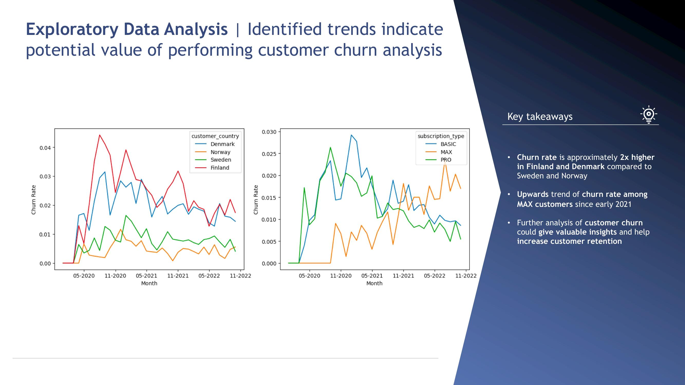
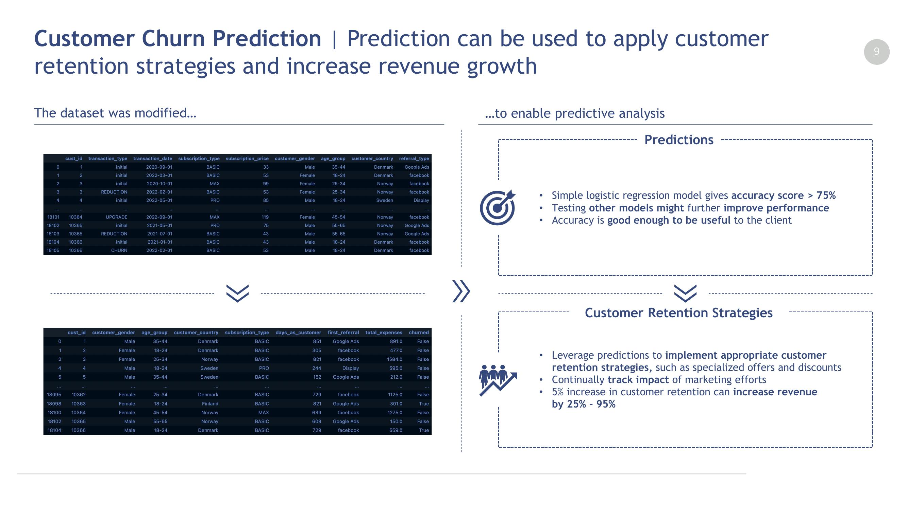
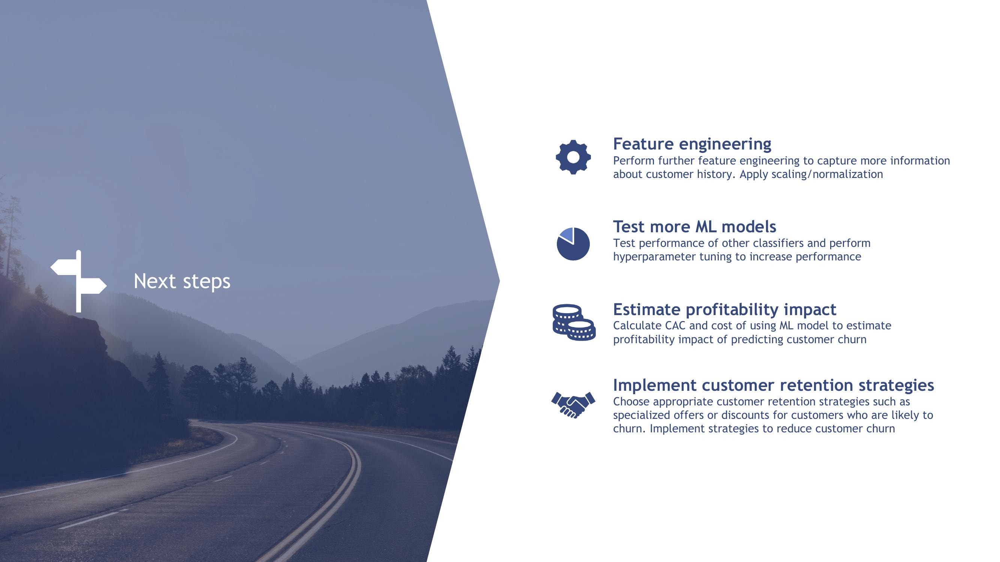
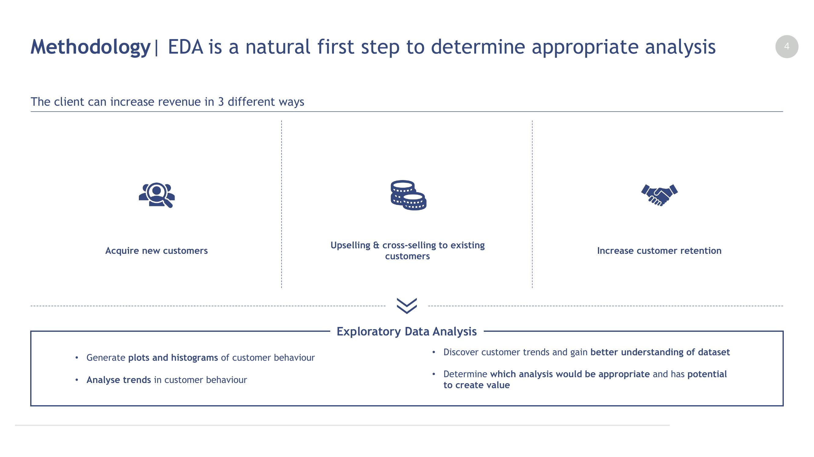

# subscription-churn-case
## Data science case study of customer churn of a subscription service
**This case study was conducted as part of an internship recruitment process.**

**The prompt for the final case study was the following:**

*Your client asks that you provide them with insights into the customer base and customer behaviors that can be used to increase revenue. You should use Python, SQL, or R to explore the data.*

**The following files were given:**

- *customer_data.csv*
- *subscription_prices.json*

**The analysis was presented with the help of a slide deck (*churn_analysis_presentation.pdf*) during a successful final interview! You can find the code that I wrote in the notebook in this repository (*analysis.ipynb*).**

Below are some example slides, that I created for the final presentation, with a brief explanation for each one:

**Exploratory data analysis (EDA)**
A summary of the interesting trends I found in the data and why it led to a customer churn/retention analysis.

**Customer churn prediction**
An explanation of how the data was manipulated to enable accurate customer churn prediction, and how the predictions could be used to increase customer retention.

**Next steps**
The next steps that *the client* should take to increase customer retention and profitability.

**Methodology**
A brief description of the methodology used to make this analysis.
